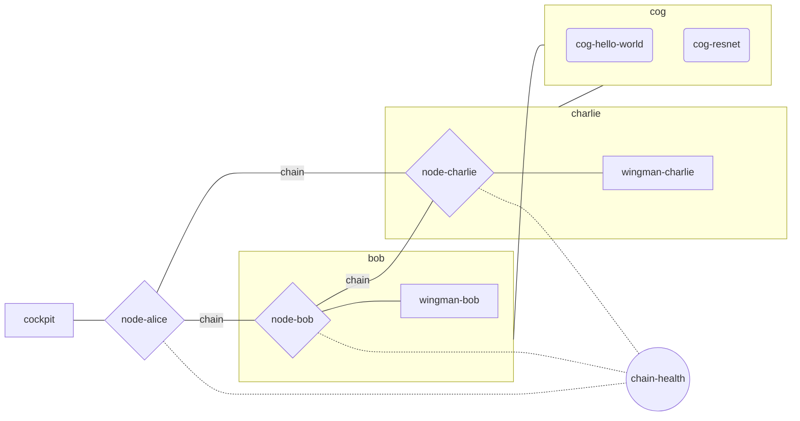

# demo

The demo project runs the aimosphere network in the following configuration:

- alice: validator
- bob: validator, provider
- charlie: validator, provider



## build docker images

To run the demo the following images should be built.

1. aimosphere/airo

cd into the `airo-node` directory and run
```sh
docker build -t aimosphere/airo .
```

2. aimosphere/wingman and cog-hello-world model

cd into the `airo-wingman` directory and run
```sh
docker build -t aimosphere/wingman .
```

then cd into the `airo-wingman/.maintain/cog/hello-world` directory and run
```sh
cog build -t cog-hello-world
```

Please, follow [this guide](https://github.com/replicate/cog?tab=readme-ov-file#install) to install cog

3. aimosphere/cockpit

cd into the `cockpit` directory and run
```sh
docker build -t aimosphere/cockpit .
```

4. aimosphere/chain-health

cd into the `chain-health` directory of the current project and run 
```sh
docker build -t aimosphere/chain-health .
```

## run demo

To run the demo, execute the following command in the root directory of the project
```sh
docker-compose up
```

It will start all the required containers.

To access the cockpit, go to [http://localhost:8080](http://localhost:8080). By default, it is attached to `node-alice`.

Bob's wingman UI (swagger) is available at [http://localhost:8000/swagger-ui/](http://localhost:8000/swagger-ui/) and Charlie's at [http://localhost:8001/swagger-ui/](http://localhost:8001/swagger-ui/)

## setup demo

To setup the demo, execute the following command in the root directory of the project
```sh
sh setup.sh
```
This will configure both wingmen, test the dx network and create NFTs for currently supported models owned by `Dave`.

### Currently supported models (model ids):
 - hello-world (0xf97fc2fdeffdaacdf4c3f35de1bb9c86faa021aa6d3e4d63fb2f910dac43198a)
 - resnet (0xa8a8481b033d25fb3d78e51b679669781ec021dc2bbc719918c702f8ada5c844)
